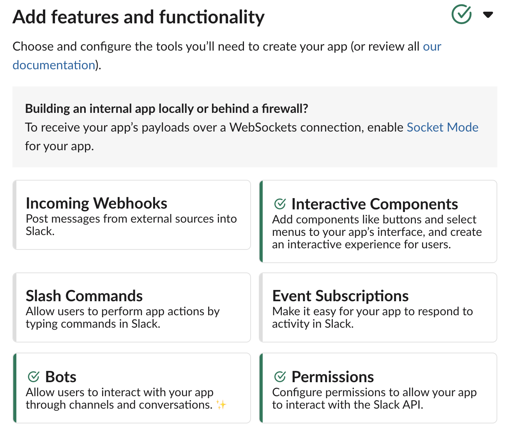

# Slack User Messaging Automation Logic

## Bot App

To use this code, you need to create a Slack App & assign it Bot feature with `chat:write` permissions.
`users:read` and `users:read.email` might help if you want to extend user lookup logic (excluded from public version of this script).



App interface available under: `https://api.slack.com/apps`

## Interactivity

You might want to user Interactive Components as well, for that you need to host a Web endpoint to receive Slack's POST requests when user presses the buttons or similar functionality. Interacitve messages can be build using Block Kit: `https://app.slack.com/block-kit-builder`. Example message can be found in `message.txt`.  

## Usage

```
% python3 send-dms.py -h
usage: 
        python3 main.py -st .slack_token -m "Hello there! :joy:" -u dtrizna,testuser,admin
        python3 main.py -st .slack_token -mF message.txt -uF user.list

Sends message to a Slack user[s] given API token.

optional arguments:
  -h, --help            show this help message and exit
  -m MESSAGE, --message MESSAGE
                        Message to send.
  -mF MESSAGEFILE, --messageFile MESSAGEFILE
                        Message to send taken from file.
  -u USERS, --users USERS
                        Comma separated user list whom to send message.
  -uF USERFILE, --userFile USERFILE
                        User list taken from file (username per line) whom to send message.
  -st SLACKTOKEN, --slackToken SLACKTOKEN
                        File with Slack token inside.
  -v, --verbose
  -d, --debug           Slack provides DEBUG logging for troubleshooting.
```

## Dependencies

Installing dependencies:

```
pip install slackclient
```

Slack's library documentation for Python:
```
https://python-slackclient.readthedocs.io/en/latest/index.html
```